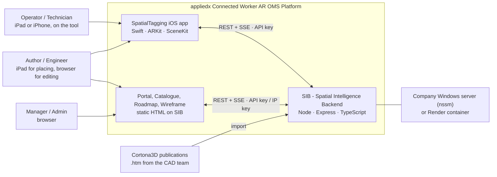
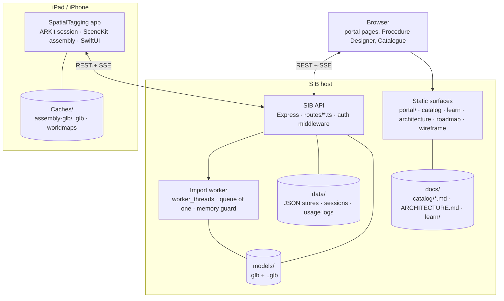
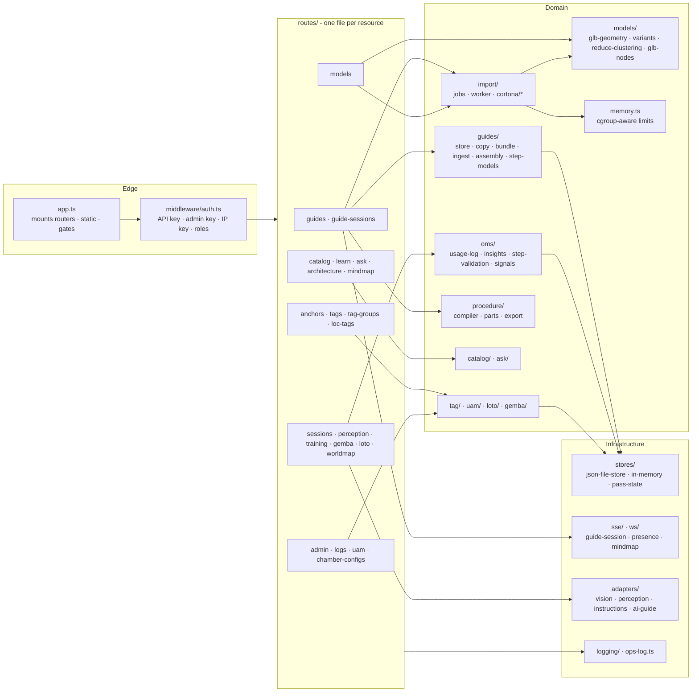
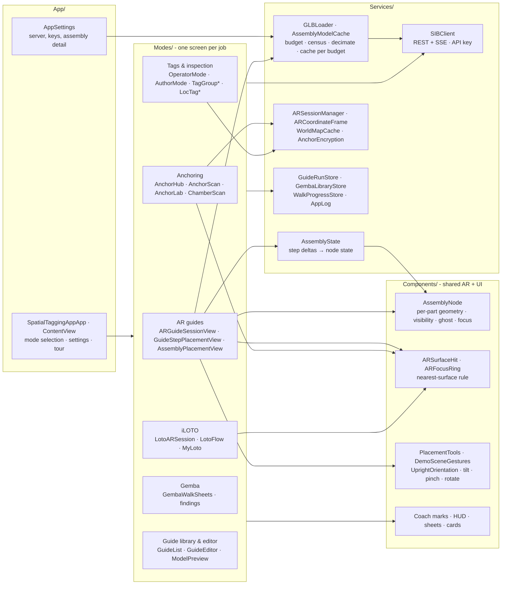
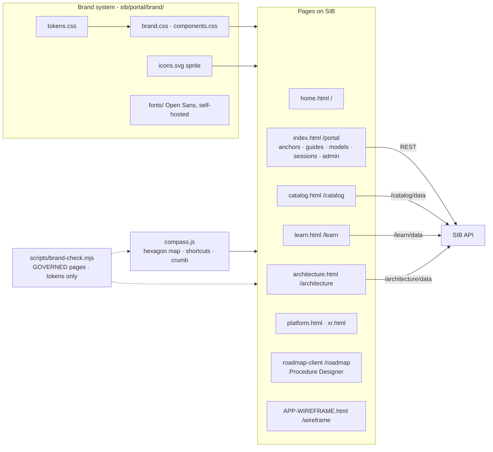

# Code architecture

Proprietary & Confidential · Applied Materials · restricted access

The Feature Catalogue (`/catalog`) is the feature-level view of the platform.
This document is the level beneath it: how the code is organised, which
parts talk to which, and why the non-obvious choices were made. It follows
the C4 model (context, containers, components, code). Levels 1 to 3 are
written by hand and change slowly; level 4 is generated from the source by
`npm run arch:graph` and checked for drift by `npm run arch:check`, the same
way the catalogue is. Rendered with the Applied Materials header at
`/architecture`, where each diagram can be downloaded as an image.

C4 is published by Simon Brown under Creative Commons Attribution 4.0
(c4model.com); the notation is free to use with attribution. Diagrams are
Mermaid (MIT), rendered from the vendored copy in `sib/portal/vendor/`.
Nothing here loads from the internet.

## Level 1 · Context

Who uses the platform and what it depends on. SIB is the source of truth;
every client talks to it over HTTPS and nothing talks to a client directly.

The operator never sees SIB. The app anchors to the physical chamber, pulls
guides, models and tags from SIB, and reports sessions back. Authors place
in AR on the same app and edit in the browser. Everything runs on one host
the fab controls; there is no cloud service in the loop.

## Level 2 · Containers

What runs where, and what each container stores.

The API process stays small on purpose: anything heavy (Cortona import,
the variant ladder) runs in a worker thread with its own heap limit so a
45 MB publication cannot take the API down with it. Stores are JSON files;
there is no database to operate. Static surfaces are plain HTML on the same
origin, so one API key and one IP key cover everything.

## Level 3 · SIB server components

`sib/src/` by responsibility. Arrows are "calls" or "reads"; the generated
level-4 graph below has the exact import edges.

Routes are thin: they validate, check the role, and call a domain module.
Domain modules never import from `routes/` or `app.ts`, which is what keeps
them testable with `node --test` against `sib/dist`. The import pipeline is
the one place that spawns a thread; `jobs.ts` owns the queue and
`worker.ts` is the only file that runs inside it.

## Level 3 · iOS app components

`ios-app/SpatialTaggingApp/` by folder. SwiftUI views live in `Modes/`,
reusable AR and UI pieces in `Components/`, everything that talks to the
network, disk or ARKit in `Services/`.

The assembly engine is three files: `AssemblyState` turns a step's deltas
into a state table, `AssemblyNode` applies that table to SceneKit nodes
(each part owns its geometry and materials, so hiding one never hides a
sibling), and `GLBLoader` builds the nodes from a GLB that the server has
already sized. Views never touch SceneKit geometry directly.

## Level 3 · Web surfaces

Every page that renders on SIB uses the one brand system; `brand:check`
fails the build on a hex colour, a CDN font, glass or a drop shadow. The
Roadmap client and the App Wireframe predate the system and are on the
backlog to adopt it.

## Level 4 · Code

Generated. `npm run arch:graph` scans `import` statements in `sib/src/` and
type references across `ios-app/` Swift files and writes
`docs/architecture/deps.json` plus two folder-level Mermaid graphs
(`deps-sib.mmd`, `deps-app.mmd`). `npm run arch:check` regenerates and
fails on drift, so the committed graph is always the code. The
`/architecture` page renders both and lets you pick any file to see what
it depends on and what depends on it.

Level 4 is never edited by hand. If a diagram at this level looks wrong,
the code is wrong.

## Decisions (ADR index)

Short records of choices that are not obvious from the code. Each is a
paragraph; the detail lives in the linked doc.

**ADR-1 · Own reducer, no mesh library.** Vertex clustering written twice
(Swift and TypeScript) with `Math.fround` so both produce identical
geometry. Rejected: Draco, meshopt, simplification libraries - a third-party
decoder on the device is against the platform rule, and the CAD colours have
no textures to preserve. `docs/ar-ojt/MODEL-VARIANTS.md`.

**ADR-2 · Import in a worker thread, queue of one.** The Cortona importer
peaks at hundreds of megabytes; inline it stalled the API and, on Render,
took the service down. A `worker_threads` Worker with
`resourceLimits.maxOldGenerationSizeMb` and a cgroup-aware guard
(`memory.ts`) refuses a job the host cannot hold rather than dying
mid-way. `docs/ar-ojt/CORTONA3D-IMPORT.md`.

**ADR-3 · Budget is a number the client declares.** `?budget=N` on the GLB
route, not a device name. A headset asks for 200 k the same way an iPad
asks for 2.5 M, and an older server that ignores the query still works
because the device reduces for itself.

**ADR-4 · Hose sweeps as flipbook frames, not runtime geometry.** Rigid
parts plus visibility deltas is the contract every client understands, so
an animated hose is baked at import into eight frames per motion window
and played with the deltas it already has. Costs file size; keeps the
players simple. `docs/ar-ojt/CORTONA3D-IMPORT.md`.

**ADR-5 · Per-part geometry and materials on the device.** SceneKit shares
geometry between clones; hiding one shared instance hid them all. Every
`AssemblyNode` copies its geometry and materials, and hides with
`isHidden` on the mesh node rather than detaching, which also avoids the
CullingSystem burst at teardown.

**ADR-6 · Nearest surface, not the first hit.** Placement takes the nearer
of the estimated plane and existing plane geometry (`ARSurfaceHit`), the
same rule in every product, so a tag lands on the table and not the floor
beneath it.

**ADR-7 · One brand system, checked in CI.** Tokens, components and the
sprite in `sib/portal/brand/`; `brand:check` and `catalog:check` run
before a commit. The iPad app is the reference and SIB does not invent
what the app does not do. `docs/BRAND.md`.

**ADR-8 · JSON file stores, no database.** The fab's server is one Windows
box under nssm. Files back up with a copy, restore with a copy, and are
readable without tooling. Revisit if a store passes tens of thousands of
records or needs concurrent writers.
